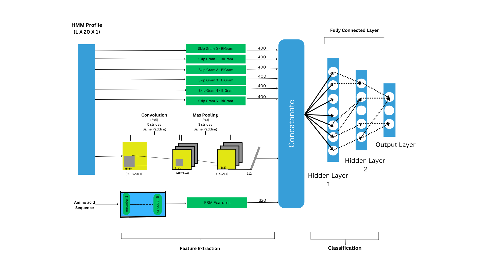
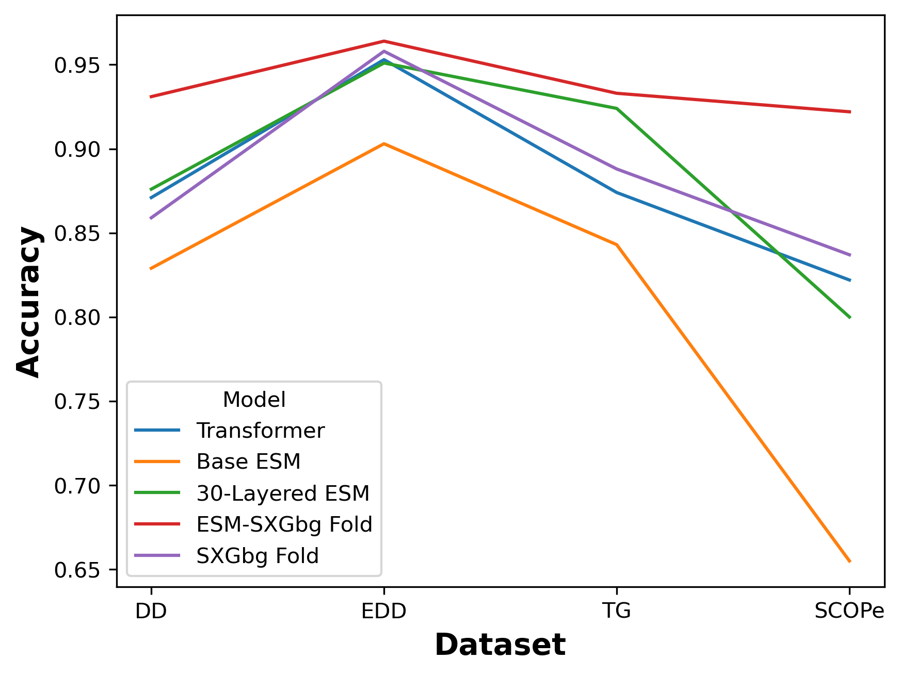

# Protein Fold Recognition using Evolutionary Scale Model (ESM) and NLP

This repository contains code and data for Protein Fold Recognition (PFR) utilizing Evolutionary Scale Models (ESM) and Natural Language Processing (NLP) techniques. The project aims to improve the accuracy of protein fold recognition by leveraging advanced language models trained on protein sequences.

## Table of Contents

- [Introduction](#introduction)
- [Features](#features)
- [Installation](#installation)
- [Usage](#usage)
- [Project Structure](#project-structure)
- [Model Architecture](#model-architecture)
- [Results](#results)
- [License](#license)

## Introduction

Protein fold recognition is a critical task in bioinformatics, essential for understanding protein functions and interactions. Traditional methods often rely on sequence alignment and structural comparison. This project explores the application of ESMs—deep learning models trained on vast protein sequence data—to enhance fold recognition capabilities.

## Features

- **ESM Integration**: Utilizes ESMs to generate embeddings for protein sequences, capturing intricate evolutionary relationships.
- **NLP Techniques**: Applies NLP methodologies to process and analyze protein sequence data effectively.
- **Comprehensive Dataset**: Includes curated datasets for training and evaluation purposes.

## Installation

To set up the project locally, follow these steps:

1. **Clone the repository**:

   ```bash
   git clone https://github.com/Pekanu/PFR-ESM-SXGbg.git
   cd PFR-ESM-SXGbg
   ```

2. **Create a virtual environment (optional but recommended)**:

  ```bash
  Copy
  Edit
  python -m venv env
  source env/bin/activate  # On Windows: env\Scripts\activate
  ```

3. Install the required dependencies:
  ```bash
  Copy
  Edit
  pip install -r requirements.txt
  ```
Note: Ensure that PyTorch is installed, as it's required for ESM.

## Usage
To run the protein fold recognition pipeline:
- Prepare your protein sequence data: Ensure your sequences are in FASTA format.
- Generate embeddings using ESM: Utilize the ESM model to convert protein sequences into embeddings.
- Run the fold recognition script:

```bash
Copy
Edit
python fold_recognition.py --input your_sequences.fasta --output results.txt
Replace your_sequences.fasta with your input file and specify the desired output file.
```
- Analyze the results: The output file will contain the predicted folds for each protein sequence.

## Project Structure
- Code/: Contains the main scripts and modules for the project.
- Data/: Includes sample datasets and related resources.
- Diagrams/: Visual representations and diagrams illustrating the model architecture and workflow.
- results.txt: Example output file showcasing the fold recognition results.

## Model Architecture
The following diagram illustrates the architecture of the model used in this project:



## Results
The performance of the model is summarized in the following results:


## License
This project is licensed under the MIT License. See the LICENSE file for more details.
